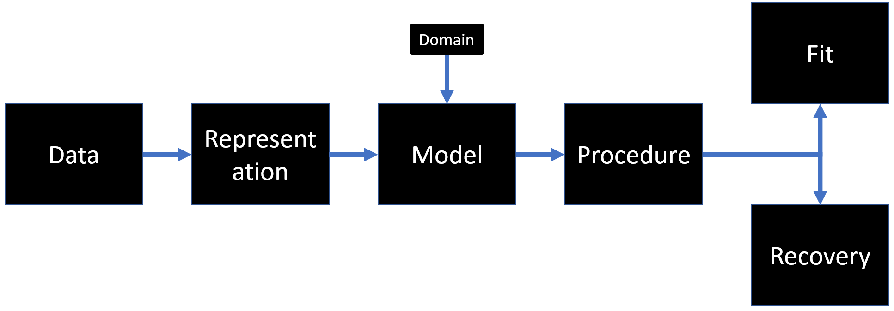

```{r setup, include=FALSE, eval= TRUE}
knitr::opts_chunk$set(collapse = TRUE, comment = "#>")
```

# Some problems to consider for drift-diffusion modeling


The image above illustrates factors that influence the two crucial results in regard to drift-diffusion modeling (and more or less modeling in general): **Fit** (i.e. measure of resemblance regarding the model input and the model prediction) and **Recovery** (i.e. measure of the validity regarding the model parameters and the model prediction). It is shown, that there is a rather long chain of interactions preceeding these two measures. Bad news first: There is no definitive answer to the choosing process regarding all these factors. Good news: The DDModeling package gives you a powerfull toolset to tinker with all of them in order to achieve good results in a relativly short amount of time. But lets first discuss each factor before we go into to much detail.

### Data
In the DDModeling package this is often refered to as RAW data, meaning unmodified total data. Regarding drift-diffusion models this is often resembled by three values:

* **Reaction time** [numeric: ms]
* **Condition**     [factor: nominal]
* **Response**      [factor: binal (correct == 1, incorrect == 0)]

Since this is more or less the starting point for your modeling endavor, there is realy nothing to do here. Make sure that your measurements are on point and your conditions are meaningfull/differentiable. Simple classic garbage in garbage out principle.

### Representation
The **Representation** represents (knock on wood) the way that your **Data** is sumarized. Often there are hundreds or even (poor subjects) thousands of trials per condition. It is a fairly realisitc assumtion that not all of these are good indications of the subject matter, or in the words of signal processing: Your **Data** very well be rather noisy! Such it is often usefull to summarize your **Data** by means of quantiles regarding specific distributions. The DDModeling package uses two such distributions, the commulative distribution function (CDF) and conditional accuracy function (CAF). To be more specific the CDFs of all correct responses per conditon and the CAFs of all conditions. While the usage of these two distributions is fixed (for now) in the package, what you can alter will be the number of quantiles to be considered. This may have a significant impact on **Fit** and **Recovery**. If choosen too low there is a risk to reduce **recovery**, because the possibility of mapping different parameter sets to one **representation** rises. Likewise if choosen too high you might try to fit noise instead of signal, reducing the predicitive value of the model by itself.

### Model
The **Model** specifies the shape 

The **Representation** can be equal to the **Data**!

At the very beginning of any modeling work there is a phase of model conceptualization. This phase constitutes three key questions:
1. What parameters constitute the model and how do they interact?
2. What is the **representation** of the data?
3. What is the **domain** the model is working on?
Surely the importance of (1) is self explanatory, you may think about the difference that the shift from a linear to a quadratic regression will cause. (2) and (3) however, while not exclusive to drift-diffusion modeling, are somewhat unique and often overlooked. The word **representation** is to be understood in relation to deep learning. There a **representation** constitutes the way data is formated for and later streamed to a network. Think about an grayscale image with a resolution of 24x24 pixels which take a value between 0 and 255 depending on their blacklevel. You could feed the network this picture flattened, meaning pixel by pixel from top left to bottom right. You could also chose to average every 4x4 pixel blocks and then flatten these.  

The DDModeling package takes this step very seriously!
# First things first
In order to use the package you have to install and load it

```{r echo = T, results = 'hide'}
library(DDModeling)
M1 <- DDModel(model="DSTP",task = "flanker",CDF_perc = c(0.1,0.3,0.5,0.7,0.9),CAF_perc = c(0.0,0.2,0.4,0.6,0.8,1.0))
R1 <- Sim_DDModel(M1,10000,simulations = 1)
#G1 <- Generate_GRID(model = M1,path = getwd(),name = "TESTGRID_DELETE",eval_pts = rep(2,ncol(M1@DM)))
```

```{r }
#F1 <- Fit_DDModel(model = M1,grid_path = G1,rep = R1,s_sampling = FALSE,trials = 10000,simplex_struc = c(1))
#summary(F1)
#plot(F1)
```

